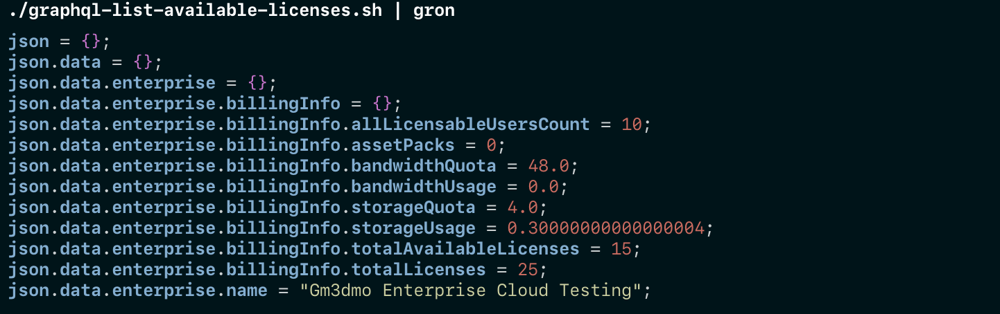

## Useful Tools

### gron

[gron](https://github.com/tomnomnom/gron) helps you understand the structure of a json respones and makes it greppable.


```
./graphql-list-available-licenses.sh | gron
json = {};
json.data = {};
json.data.enterprise = {};
json.data.enterprise.billingInfo = {};
json.data.enterprise.billingInfo.allLicensableUsersCount = 10;
json.data.enterprise.billingInfo.assetPacks = 0;
json.data.enterprise.billingInfo.bandwidthQuota = 48.0;
json.data.enterprise.billingInfo.bandwidthUsage = 0.0;
json.data.enterprise.billingInfo.storageQuota = 4.0;
json.data.enterprise.billingInfo.storageUsage = 0.30000000000000004;
json.data.enterprise.billingInfo.totalAvailableLicenses = 15;
json.data.enterprise.billingInfo.totalLicenses = 25;
json.data.enterprise.name = "Gm3dmo Enterprise Cloud Testing";
```


