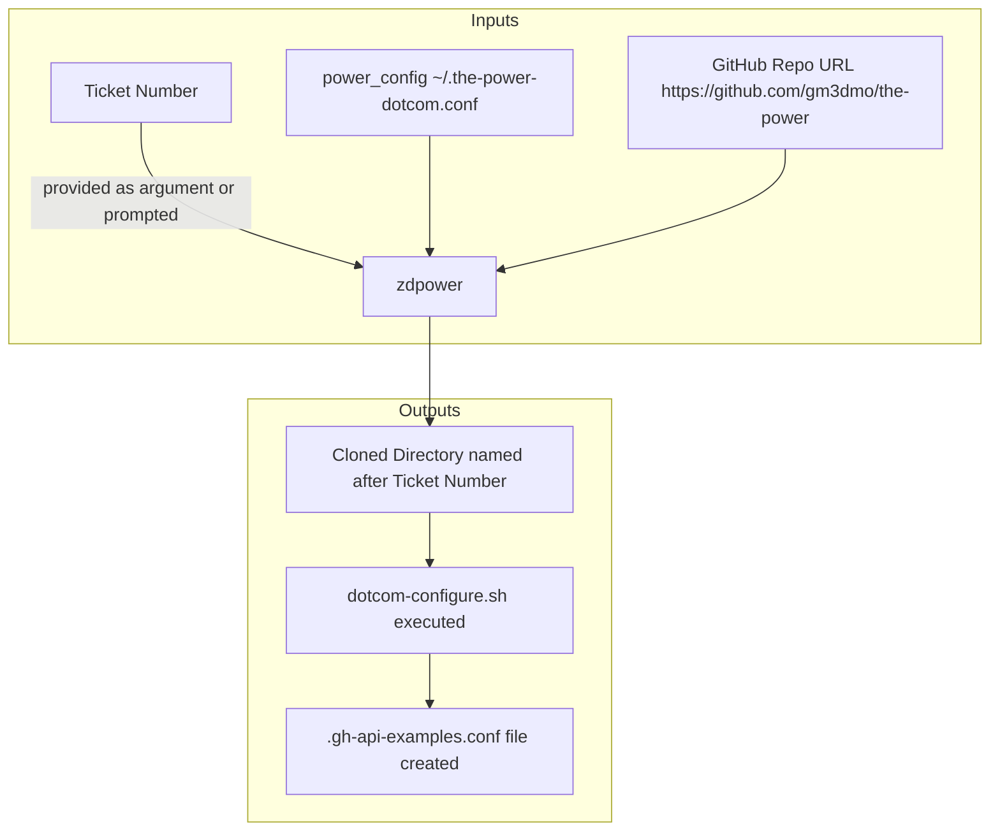

# Creating separate installations with the `zdpower` script
The `zdpower` script is a handy wrapper over configure.py for use in cases where multiple copies of the power are needed. 

#. Make sure you have a home bin directory `mkdir -p ~/bin`
#. Copy `zdpower` to your home directory `cp zdpower ~/bin && chmod 500 ~/bin/zdpower` 
#. Copy this skeleton file to your ime directory `cp the-power-dotcom.skeleton  ~/.the-power-dotcom.conf`
#. Edit this new `~/.the-power-dotcom.conf` file with all of the appropriate values for your environment like your github_token, enterprise and organization name.
#. Run `dotcom-configure.sh` to set the power up to target your dotcom environment.

