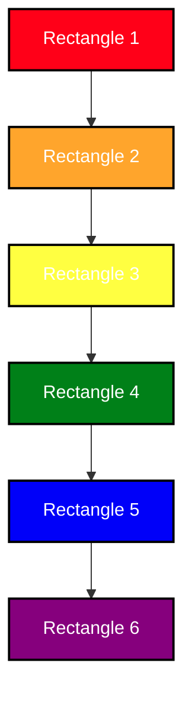

### Description:

Our access control software has a critical security vulnerability that allows dogs to access the database without authentication. This issue poses a significant risk to the security and integrity of our system, as it allows unauthorized parties to gain access to sensitive information and potentially cause damage.

### Steps to Reproduce:

Have a dog (or any animal with paws) attempt to access the database without authentication.
The system should allow access without requiring any form of authentication or authorization.
Expected Behavior:

The access control software should only allow access to authorized users who have provided valid credentials and have the appropriate permissions.

### Actual Behavior:

The system allows dogs (or any other animal with 🐾) to access the database without any form of authentication or authorization.

### Impact:

This security vulnerability allows unauthorized access to the system, potentially exposing sensitive data to unauthorized parties. It poses a significant risk to the confidentiality, integrity, and availability of our data.

### Recommendation:

We recommend immediately fixing this security vulnerability by implementing proper authentication and authorization controls to prevent unauthorized access to the system. Additionally, we recommend reviewing the access control software for other security vulnerabilities and taking appropriate steps to mitigate them.

### Proposed Fix Checklist

- [x] Implement proper authentication and authorization controls to prevent unauthorized access to the system.
- [ ] Review the access control software for other security vulnerabilities and take appropriate steps to mitigate them.
- [ ] Test the fixes thoroughly to ensure they effectively address the security vulnerability.
- [ ] Deploy the fixes to the production environment.
- [ ] Monitor the system for any signs of unauthorized access or other security incidents following the fix deployment.
- [ ] Consider conducting a security audit to identify and address any other security vulnerabilities in the system.
- [ ] #1
- [ ] #2

### The Obligatory Diagram

That's it.That's the diagram.

> [!NOTE]
> Highlights information that users should take into account, even when skimming.

> [!IMPORTANT]
> Crucial information necessary for users to succeed.

> [!WARNING]
> Critical content demanding immediate user attention due to potential risks.
