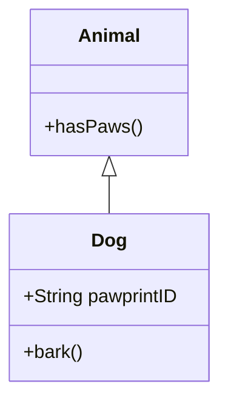

# Paw Print Recognition Enhancement

Pull request to propose a new feature for our dog paw print (🐾) recognition system. Currently, our system is able to recognize basic paw shapes and sizes, but it is not able to identify individual dogs based on their unique paw prints. To address this issue, I propose the implementation of a pattern recognition algorithm that can identify specific dogs based on their paw prints.

To achieve this, we suggest using a combination of image processing techniques and machine learning algorithms. Specifically, we can use edge detection to extract the shape of the paw print and then use a neural network to recognize unique patterns within the paw print. This would allow our system to identify individual dogs based on their unique paw prints with high accuracy.



### Special mention
The problem described in #1 should be resolved by this PR. This appear in the graphql [pullrequest closingIssuesReferences](https://docs.github.com/en/graphql/reference/objects#pullrequest) 

- Resolve #1


### Feature demonstration

To demonstrate this feature, We have written an example code in Fortran that implements a basic pattern recognition algorithm using a neural network. The code takes as input a grayscale image of a dog paw print and outputs a prediction of which dog the paw print belongs to. Here is the example code:

```fortran
program paw_print_recognition
  implicit none
  
  ! Input parameters
  integer, parameter :: n_hidden = 10 ! Number of hidden neurons
  real, parameter :: learning_rate = 0.1 ! Learning rate
  
  ! Variables
  real :: x(n_input) ! Input vector
  integer :: i, j, k, epoch ! Loop counters
  
  ! Initialize weights and biases
  call random_number(w1)

  ! Train the neural network
  do epoch = 1, n_epochs
    ! Loop over training data
    do i = 1, n_training
      ! Forward pass
      x = input_data(i,:)
      a2 = softmax(z2)
      
      ! Backward pass
      delta1 = delta2 * transpose(w2) * (1 - tanh(z1)**2)
      db1 = sum(delta1, dim=1)
      
    end do
```

## Prior Art
There have been a number of paw print recognition systems over the years. We've built on those and learned a great deal.
